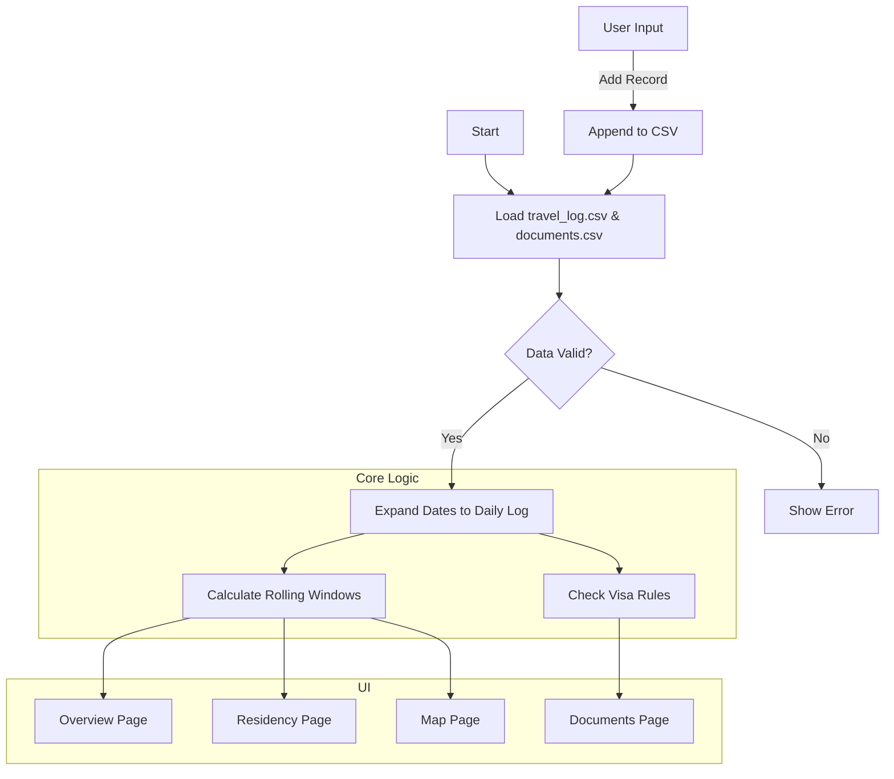

# 📝 Project Plan: Residency + Visa Tracker

## 1. Context & Goal

> **Objective:** Build a "Residency + Visa Tracker" Streamlit application to track travel history, calculate residency days (rolling windows), and monitor visa/document expiration and compliance rules.
> **Success Metrics:**
>
> - Correctly calculates days spent in each country for any given period.
> - Accurately computes rolling window counts (e.g., 90/180 days).
> - Flags visa expirations and rule violations correctly.
> - Streamlit app is functional and interactive.
> - All core logic is covered by tests.
> **Mode:** ENGINEERING (TDD)

---

## 2. The Data Contract (CRITICAL)

**Input Schema (CSV Files):**

1. `travel_log.csv`

    ```csv
    start_date,end_date,country,iso3,notes
    2023-01-01,2023-01-15,United States,USA,Holiday
    ```

2. `documents.csv`

    ```csv
    doc_type,country,name,issue_date,expiry_date,max_days,window_days,renew_before_days,notes
    visa,Schengen,Tourist Visa,2023-01-01,2024-01-01,90,180,30,Multi-entry
    ```

**Internal Data Models (Python dataclasses/Pandas):**

```python
from dataclasses import dataclass
from datetime import date
from typing import Optional

@dataclass
class TravelEntry:
    start_date: date
    end_date: date
    country: str
    iso3: Optional[str] = None
    notes: Optional[str] = None

@dataclass
class Document:
    doc_type: str  # 'passport' or 'visa'
    country: str
    name: str
    issue_date: date
    expiry_date: date
    max_days: Optional[int] = None
    window_days: Optional[int] = None
    renew_before_days: Optional[int] = None
    notes: Optional[str] = None

@dataclass
class ResidencyStatus:
    country: str
    days_last_183: int
    days_last_365: int
    days_custom: int
    current_streak: int
```

---

## 3. High-Level Strategy

### A. Logic Flow (Pseudocode)

```python
def load_data():
    # Load CSVs into Pandas DataFrames
    # Validate types and required columns
    pass

def expand_travel_dates(travel_log_df):
    # Convert start/end ranges into a daily DataFrame
    # Index: date, Columns: country, iso3
    # Handle overlaps (latest entry takes precedence or error)
    pass

def calculate_residency(daily_df, window_days):
    # For a given country, calculate rolling sum of days present
    # Return count for the window ending today (or specified date)
    pass

def check_visa_compliance(documents_df, daily_df):
    # For each document:
    # 1. Check expiry date vs today + renew_before_days
    # 2. If max_days/window_days exists (e.g., 90/180):
    #    Calculate days spent in document.country in the last window_days
    #    Check if > max_days
    pass
```

### B. Visual Flow (Mermaid)



---

## 4. Architecture & File Structure

| Role | File Path | Description |
| --- | --- | --- |
| **Source** | `src/country_tracker/models.py` | Data classes and validation logic |
| **Source** | `src/country_tracker/services.py` | Core calculations (residency, compliance) |
| **Source** | `src/country_tracker/data.py` | CSV loading and saving |
| **Source** | `src/country_tracker/app.py` | Main Streamlit application |
| **Source** | `src/country_tracker/pages/*.py` | Streamlit pages (Overview, Residency, etc.) |
| **Test** | `tests/test_services.py` | Unit tests for logic |
| **Test** | `tests/test_data.py` | Unit tests for data loading |
| **Data** | `data/*.csv` | Storage for CSV files |

---

## 5. Cruxes & Uncertainties

- [ ] **Risk 1:** Overlapping travel dates in `travel_log.csv`. Logic needs to handle this (e.g., error or merge).
- [ ] **Risk 2:** Performance of rolling window calculations if history is very long (unlikely for personal travel, but good to keep in mind).
- [ ] **Risk 3:** Ambiguity in "country" names between travel log and documents (e.g., "USA" vs "United States"). Need standardization or fuzzy matching? (Will assume exact match for MVP).

---

## 6. Execution Milestones (The Checklist)

### Phase 1: Setup & Data Layer (TDD)

- [x] **Scaffold:** Create file structure, `data/` directory, and sample CSVs.
- [x] **Test (Red):** Write test for loading and validating `travel_log.csv` and `documents.csv`.
- [x] **Run:** Confirm test fails.
- [x] **Implement (Green):** Implement `DataLoader` in `src/country_tracker/data.py`.
- [x] **Run:** Confirm test passes.

### Phase 2: Core Logic - Residency (TDD)

- [x] **Test (Red):** Write test for expanding date ranges to daily records.
- [x] **Implement (Green):** Implement `expand_travel_dates` in `src/country_tracker/services.py`.
- [x] **Test (Red):** Write test for calculating rolling window counts (183, 365 days).
- [x] **Implement (Green):** Implement `calculate_residency` in `src/country_tracker/services.py`.

### Phase 3: Core Logic - Compliance (TDD)

- [x] **Test (Red):** Write test for visa expiry checks and 90/180 rule validation.
- [x] **Implement (Green):** Implement `check_compliance` in `src/country_tracker/services.py`.

### Phase 4: Streamlit UI - Basic Pages

- [x] **Implement:** Create `src/country_tracker/app.py` (Overview).
- [x] **Implement:** Create `src/country_tracker/pages/1_Residency.py`.
- [x] **Implement:** Create `src/country_tracker/pages/2_Map.py`.
- [x] **Implement:** Create `src/country_tracker/pages/3_Documents.py`.

### Phase 5: Streamlit UI - Data Entry

- [x] **Implement:** Create `src/country_tracker/pages/4_Data_Entry.py` with forms to append to CSVs.
- [x] **Verify:** Manual test of the full flow (Add data -> Check Overview).
